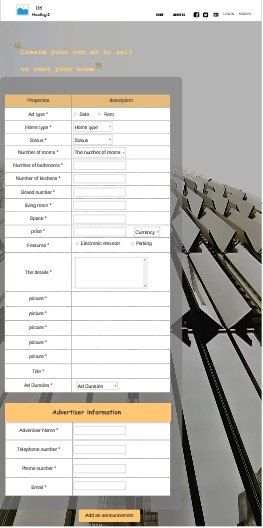
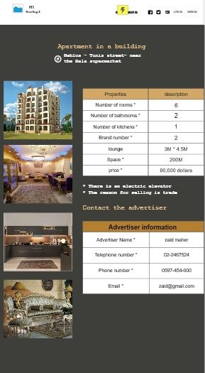
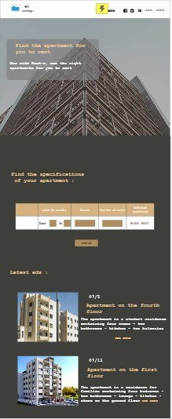

# REST-E
## Who Are We?

__Rest-E__ is an online platform specializing in residential property
services, which aims to make it easier for all to buy. sell, or rent
residential real-estate through our easy-to-use online website
services.

Currently based in Nablus, our continuously-growing platform is
dedicated to serving buyers, sellers, renters, and even university¬
hostel owners, as the provided services are neatly-categorized to
suit each of the aforementioned group's needs respectively.

Our services provide simplicity, making it much easier and safer to
buy or rent a house, bypassing all sale contracts through a forum
which has the full details of the retailer or renter to provide
authentic credentials proving the ownership of the *Real-Estate*.

The provided services also include the ability to browse available
residential property freely and easily through our website,
allowing the user to choose from a large library of rental or for-
sale houses with various price-tags and different settings, and

Finally providing them with the required information regarding the
retailer/renter and the various communication addresses.

Our platform supports the different payment methods, whether it's
indirect transfer, Visa card, or in cash.

## Why Us?

The competitive sites we have chosen to analyze  is : 
1. __[aqari](http://www.aqari.ps/)__ : 
    - No pages were found to be using defined headings. This means that users and search engines may find it harder to determine the content of this website's page
    - 35 links use text that is too long. Links should describe what they link to briefly.
    - 17 links have no text describing their destination
    - Most images (87.0%) don't have defined sizes using width and height attributes in the HTML.
    - They don't have a custom 404 Error Page.

2. __[rawabi](https://www.rawabi.ps/ar)__ :
    - 3 pages of this website have very little content (20 words or less).
    - 9 links have no text describing their destination
    - No images have defined sizes.

3. __[trulia](https://www.trulia.com/)__
    - Most images (74.0%) don't have defined sizes using width and height attributes in the HTML.
    - 3 links have no text describing their destination.
    - 9 images are being stretched in the browser.
    - Find the tap targets that are too small, their size in pixels, and the overlapping target that is too close to be easily clicked.

The most important site that made us do this site is Facebook.
Most companies and *Real-Estate* establish pages on Facebook and communicate with the customer through it, but it is not an official way to sell, for example, homes, so we resorted to this idea... A site specialized in selling homes and renting student dormitories will be a very good alternative For widespread and unofficial Facebook pages in companies.

##### Our Features

|User interface|Front-End Dev|
|---	|---	|
|A secure feeling|Use HTML,CSS,JS in a professional way|
|An easy shopping experience.|improved with SEO|
|Interact with the customer|Use effective call-to-action buttons|
|The content is arranged in a way that facilitates the client's reaching his goal|Custom 404 Error Page|
|Attracts the customer|Response Web Design|

##### One More Thing...
After analyzing many sites, it is time to answer the question ... Why Us? Basically, the analysis that we did helped us to know the weaknesses of our competitors and avoid them until we top the first position among companies .. We also noted that the most common weaknesses were in the use of the CSS and the size of the images inside it. Also the use of heading in all the pages of the sites as there are links that did not Be under the excellent standard of SEO... In the end, we must note that the staff working on this site are trained on what excellent sites like CSS, HTML, JS need ... Dear customer after implementing the site you will not regret dealing with us because we found to implement what you requested at the best Condition.

> We used this site to find the competition website __[neilpatel](https://neilpatel.com/)__.
>
> We used these sites to analyze competing websites __[nibbler](https://nibbler.silktide.com/en_US)__ and __[woorank](https://www.woorank.com/)__.

## Who Are Our Clients?
The potential customers for our project are people who want to sell/lease houses/apartments,
 the houses can be bought by anyone using the website and the apartment can be rented only by students. 

## What it's Look Like?

The site contains ten pages, the first is the main page, and contains three sections: header, body, footer,
The header is the same in ten pages
On the left side, the head contains the website logo and the name of the website, and a short sentence about the website.
It also contains buttons on the right that are represented in the home page button and when you click on it you will be taken to the main page, a button of who we are and when you click on it you will be taken to the section of who we are on the main page, the Facebook button and when you click on it you will be taken to the site’s account on Facebook, Twitter button and when you click on it you will be taken to the site's account on Twitter, and the login and registration buttons on the site and when you click on any of them you will be taken to each page
The body contains a picture with welcome writing of the site, it also contains three buttons represented in pictures and texts, and these buttons when you click on each of them are moved to the content and what is meant by the images and texts,
The body also contains a section of who we are to be moved to if the dedicated button on the head is pressed
The footer contains pictures of the houses available on the site and when you click on any of them you will be taken to the home page announced on the site.

The second page is the login page and contains the unified header on all pages, it also contains an image as the background of the page, and contains a login form that consists of the user name or e-mail, the password, and an access button after filling in the information, or it is possible to log in with Facebook Or Google if they were previously linked to the site.

The third page is the account creation page and it contains the unified header on all pages, it also contains an image as the background of the page, and contains an account creation form that contains the first name and last name, password creation, email, mobile number, and the account creation button to provide this information.

The fourth page is the page for creating an advertisement for sale and it contains the unified header on all pages, it also contains an image as the background for the page, and it contains an ad creation form that contains the basic information of the house to be sold
It also contains a form containing information about the advertiser, and a button for providing advertisement information.

The fifth page is the purchase page and contains the unified header in all pages, and also contains two sections: The first section: contains a picture as the background of the site and contains two texts
The second section: It contains a color background, it also contains a form in which the buyer puts the information of the house he wants to buy and a search button that provides home information,
It also contains the most recent announcements section, which contains a picture and preliminary information about the house, and when you click on any of them you will be taken to the home page and show more information about the house in it.

The sixth page is the home page of the chosen house and pressed to show information about it, and it contains the unified header on all pages,
It contains the home address, home information, information about the person who announced the home, as well as photos of the home.

_And also on the seventh page._

The eighth page is the rental page and contains the unified header in all the pages. It also contains two sections: The first section: It contains a picture as the background of the site and contains text
The second section: It contains a color background, it also contains a form in which the tenant places the apartment information he wants to rent and a search button that provides the apartment information,
It also contains the most recent announcements section, which contains a picture and preliminary information about the apartment, and when you click on any of them you will be taken to the pages of the apartments, where information about the apartment and information about the advertiser.

The ninth page is the home page of the apartment that was chosen and pressed to show information about it, and it contains the unified header on all pages,
It contains the title of the apartment, apartment information, information about the person who announced the apartment, as well as photos of the apartment.

_And also the tenth page._

